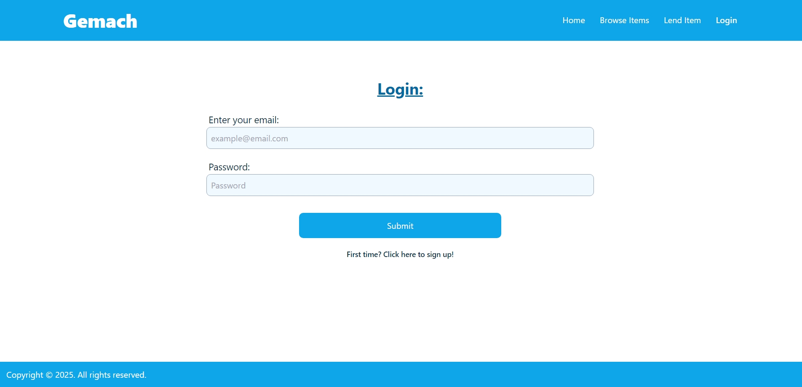
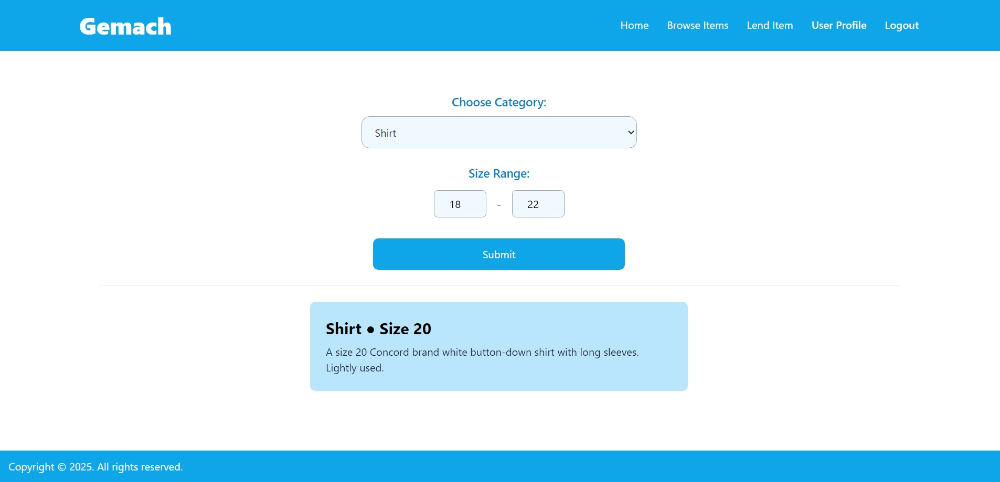
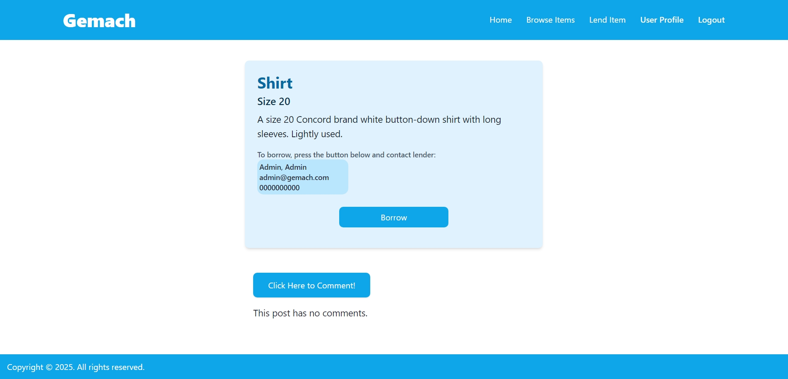
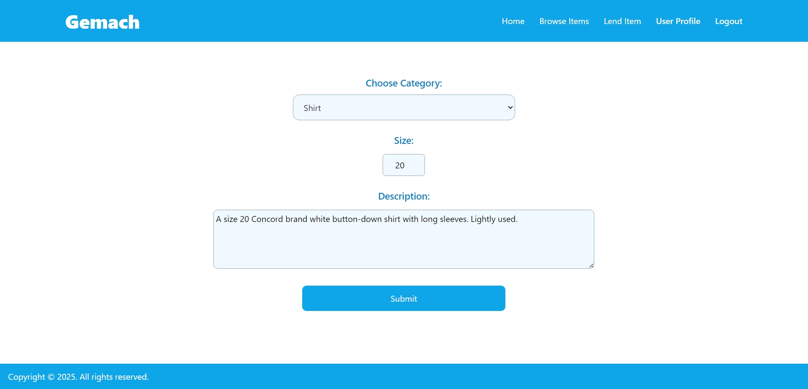
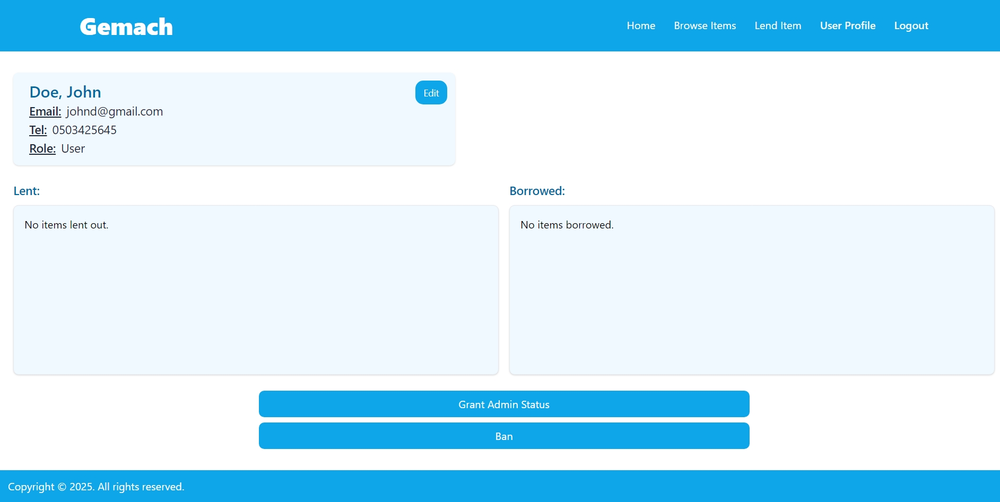
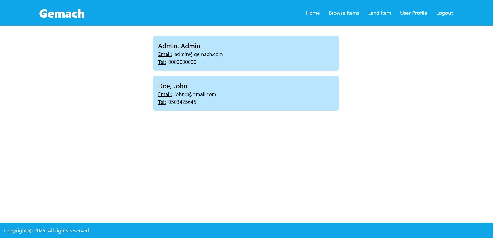

# Shabbat Clothes Gemach Application

An application simulating a clothes gemach created using React and Express as part of job training. It can be run on your local machine, where you can register, post items to lend, search items to borrow, view you user profile, edit and delete information, and more.

## Clone the Repository

To get a copy of the repository on your local machine, open your terminal and run the following command:

```
git clone https://github.com/akivaab/training-app.git
```

Or, you can download the ZIP file from the GitHub page.

## Running the Project

#### Setup MySQL Database

This application requires MySQL to be running in order to work. Install MySQL if you don't have it already, and create a database for the application to have access to.

```
CREATE DATABASE database_name;
```

#### Add .env Files

Once you’ve cloned or downloaded the repository, you must add a .env file in both the server and client directories. There are .env.example files in both directories explaining what environment variables must be added.

- [server/.env example](server/.env.example)
- [client/.env example](client/.env.example)

#### Run Server and Client

Once the .env files are added, open two instances of the terminal and navigate to the root directory of the repository in both.

Enter the following commands in the first terminal:

```
cd server
npm install
npm run start
```

Then enter the following commands in the second terminal:

```
cd client
npm install
npm run dev
```

Click on the provided link to open the project on a port of your local machine.

## Overview

### Login

Upon opening the app, you will be directed to a main page asking you to login or register if it is your first time using the app. You can either register, or use the default user created when the app runs for the first time. This user has admin status, and you can use the following credentials to log in:
Email: `admin@gemach.com`
Password: `admin`



### Browse

After logging in, you will reach the menu page. From here you can click the links to perform various actions, such as to browse the available items based on specific criteria.



You can then click on an item to see a more detailed page about it. From this page you can reserve the item for borrowing and use the lender's contact information to arrange a way to retrieve it from them. You can also read comments other users wrote about this item.



### Lend

You can also post an item that you are willing to lend out! Simply click the link in the menu or header, fill in the appropriate information, and submit!



### Users

You can view your user profile, from where you can edit your personal information and see the items that you have lent out and are borrowing.



For admins only, you can see a list of all users registered to the site. Admins are also granted the ability to edit item and user information, ban users, grant users admin status, and more.


